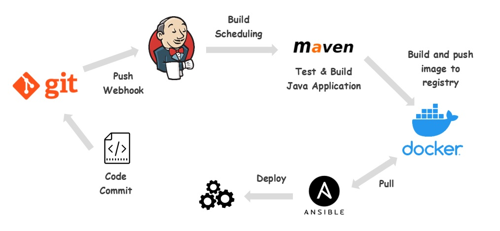
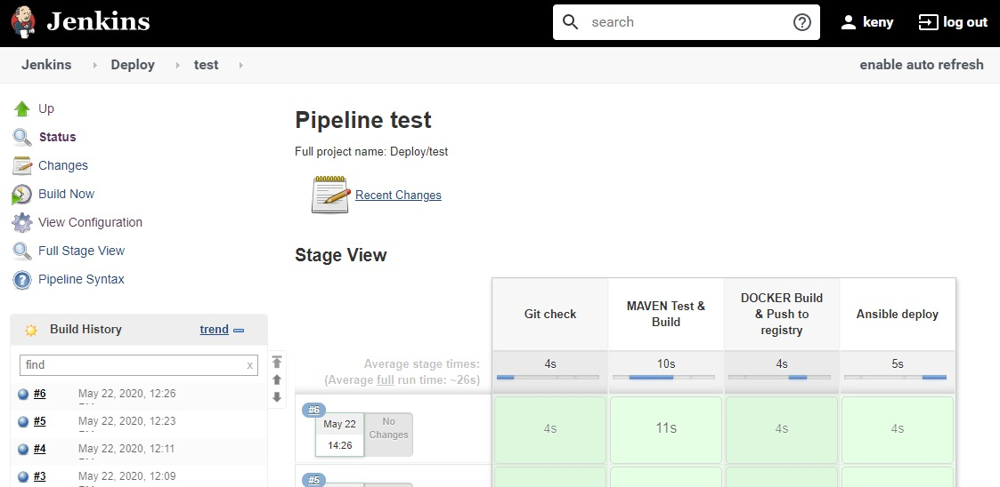
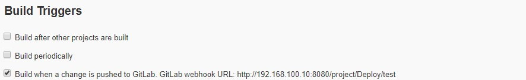

# Setting up a simple CI/CD pipeline

**Objective : Deploy a "Hello-World" Java Springboot app with Docker<br>
In this example we'll Trigger a pipeline for each commit or push**

# Infrastructure

| VM (Virtualbox) | IP Address | Role | Packages |
|---|---|---|---|
| app-test | 192.168.100.48 | Server app for test envrionnment | Docker |
| app-preprod | 192.168.100.49 | Server app for preprod envrionnment | Docker |
| app-prod | 192.168.100.50 | Server app for test envrionnment | Docker |
| mydata | 192.168.100.20 | Docker registry | Docker, docker-compose |
| Jenkins | 192.168.100.10 | Run and test app with maven | Jenkins, maven, Docker |
  
You can build them with this [Vagrantfile](vagrant/Vagrantfile)<br><br>

# Workflow

<br><br>

# Pipeline Steps

|  |  | Description |
|---|---|---|
| **STAGE 1** | **GIT** | Git Checkout |
| **STAGE 2** | **MAVEN** | Test and Build Java Spring Boot application using Apache Maven |
| **STAGE 3** | **DOCKER** | Create a docker image a push it to our private docker registry |
| **STAGE 4** | **ANSIBLE** | Deploy docker image from registry and run it on target server |

Pipeline code can be found [here](Jenkinsfile.groovy)<br><br>

# Configuration

## Docker Registry

Registry is already configured, please refer to **docker-compose-registry.yml** in this [ansible playbook](vagrant/mydata.yml) used by Vagrant

## Jenkins

1. **Prerequisites**
    - with jenkins user, copy the SSH public key for other app servers.
        ```bash
        ssh-copy-id -i .ssh/id_rsa.pub vagrant@192.168.100.48
        ssh-copy-id -i .ssh/id_rsa.pub vagrant@192.168.100.49
        ssh-copy-id -i .ssh/id_rsa.pub vagrant@192.168.100.50
        ```
    -  Add your git server to /etc/hosts
        ```bash
        127.0.0.1       localhost
        127.0.1.1       jenkins jenkins
        192.168.100.30  git-server
        ```
        
2. **Confgure Jenkins**
    -  Go to **Manage Jenkins** > **Manage Plugins** > **Available tab** > Install Git and Ansible plugins
    -  Add Credentials for Git (login/pwd)
    
3. **Create a Multibranch pipeline:**
    - **New item** > **Multibrach pipeline** > add Git repo with credentials
    - **Build configuration** : Add jenkinsfile "Jenkinsfile.groovy"

## Git Server
1. Clone this [repo](http://about:blank) to your git server
2. Create 3 branches, in this example : **test, preprod and prod.**
2. Add Outbound requests whitelist for local networks, see below an example with gitlab
    - Go to **Settings** > **Outbound requests** :
    - Check box "Allow requests to the local network from web hooks and services"
    - Add Jenkins IP address
    
3. Add a Webhook for each branches :
    - Add Jenkins URL and Token as defined by [Jenkinsfile](Jenkinsfile.groovy)<br>
   <sup>exemple : http://192.168.100.10:8080/projet/deploy/test</sup>

| :warning:        If files are hosted on your own personal repo (Github, Bitbucket, Gitlab...), you should use tools like Ngrok or SocketXP to interconnect your local Jenkins server. More informations: [socketxp](https://www.socketxp.com/webhookrelay/github-webhook-localhost-jenkins/) and [ngrok](https://medium.com/@developerwakeling/setting-up-github-webhooks-jenkins-and-ngrok-for-local-development-f4b2c1ab5b6)  |
|-----------------------------------------|

# Build
**Build Now**<br><br>


Go to **View configuration**, as you can see below, "Build trigger" properties were added.<br><br>


Now, following jobs will run automatically after each push to git repo.

# Application

Spring Boot web application (created with thymeleaf) is now deployed on servers.<br>
See this [Dockerfile](Dockerfile) for more informations.

```
$ curl http://192.168.100.48:9000
<!DOCTYPE html>
<html lang="en">
<head>
    <meta charset="utf-8">
    <link rel="stylesheet" href="https://stackpath.bootstrapcdn.com/bootstrap/4.4.1/css/bootstrap.min.css"/>
    <link href="/css/main.css?" rel="stylesheet">
    <title>My app</title>
</head>
<body>

<main role="main" class="container">
    <div class="starter-template">
        <h1>Application</h1>
        <p>Welcome</p>
        <p>ID: 555cf1cec83c</p>
    </div>
</main>

<script src="/js/main.js"></script>
</body>

</html>
```

# Possible Extensions
- Factor out most common pipeline code
- Create a Restful API and run tests using Apache JMeter.
- Monitor / Collect data metrics with elastic
